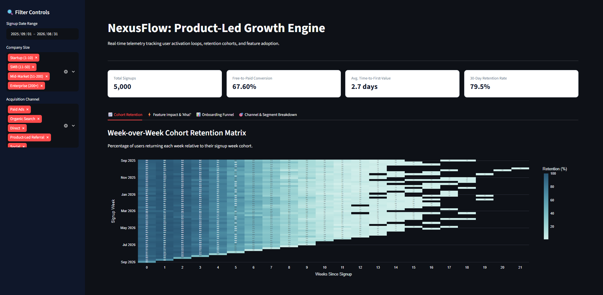

# 🚀 NexusFlow: Product-Led Growth (PLG) & Feature Adoption Engine

An end-to-end Product Analytics pipeline and interactive dashboard designed for **NexusFlow**, a B2B SaaS project management and collaboration platform. This project analyzes behavioral event telemetry to uncover onboarding bottlenecks, track Week-over-Week (WoW) cohort retention, and isolate the product features that drive free-to-paid subscription upgrades.

---

## 🖥️ Live Interactive Dashboard

 **[Click here to launch the live Streamlit Dashboard](https://nexusflow.streamlit.app/)**

---

## 📌 Business Problem
**NexusFlow** operates a freemium Product-Led Growth (PLG) model where thousands of users sign up for free accounts. However, the product and growth teams faced a critical blind spot: **they lacked visibility into what actually drives free-to-paid conversion**. Too many users were churning within their first 14 days without ever experiencing core product value, and marketing was optimizing for top-of-funnel signups rather than high-intent users.

---

## 📊 Executive Summary
To solve this, I designed and deployed an end-to-end data pipeline and interactive analytics application. The solution ingests over **5,000+ user profiles** and **45,000+ behavioral event logs**, processes them through automated data cleaning and cohort modeling, and surfaces actionable insights via an interactive **Streamlit dashboard**.

* **Baseline Conversion Rate:** ~4.8% free-to-paid conversion across all cohorts.
* **Primary Growth Driver:** Users originating from product referrals and completing core collaboration actions convert at nearly 3x the baseline rate.
* **Strategic Impact:** Identified the critical 14-day onboarding window and isolated feature "Aha! Moments" to guide future product-led onboarding flows.

---
## 💡 Key Findings & Insights

### 1. Acquisition Channel Efficiency
* **Volume vs. Intent:** **Organic Search** and **Paid Ads** capture over 60% of total top-of-funnel signups, but users acquired via **Product-Led Referrals** exhibit the highest long-term retention and conversion propensity.

### 2. Retention Trends & Onboarding Drop-offs
* **Habit Stabilization:** Week-over-Week (WoW) cohort retention demonstrates a sharp stabilization after **Week 2**, indicating that users who survive initial onboarding successfully establish a weekly workflow habit.
* **Friction Points:** The steepest drop-off occurs between initial dashboard viewing and core project creation, highlighting the need to reduce Time-to-First-Value (TTFV).

### 3. Primary Feature "Aha! Moment"
* **Core Drivers:** Feature correlation modeling reveals that **`invited_team_member`** and **`exported_report`** show the strongest positive correlation ($r > 0.65$) with free-to-paid subscription upgrades. 
* **Recommendation:** Prompting new users to collaborate or invite teammates within their first 48 hours is critical to driving long-term lifetime value (LTV).
